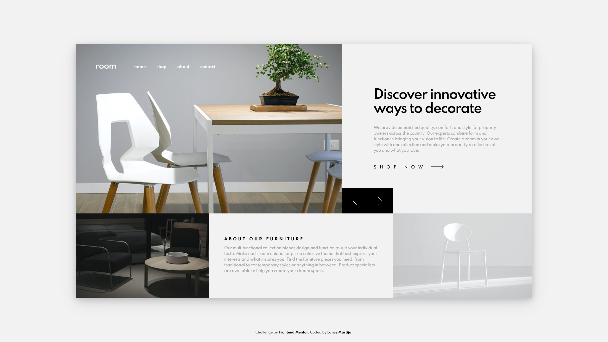
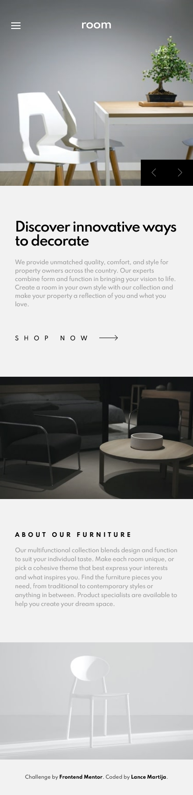
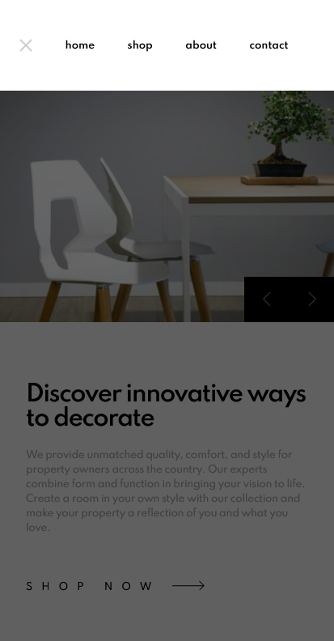

# Frontend Mentor - Room homepage solution

This is a solution to the [Room homepage challenge on Frontend Mentor](https://www.frontendmentor.io/challenges/room-homepage-BtdBY_ENq). Frontend Mentor challenges help you improve your coding skills by building realistic projects. 

## Table of contents

- [Overview](#overview)
  - [The challenge](#the-challenge)
  - [Screenshot](#screenshot)
  - [Links](#links)
- [My process](#my-process)
  - [Built with](#built-with)
- [Author](#author)

## Overview

### The challenge

Users should be able to:

- View the optimal layout for the site depending on their device's screen size
- See hover states for all interactive elements on the page
- Navigate the slider using either their mouse/trackpad or keyboard

### Screenshot

### Links

- Solution URL: [Responsive Room Homepage using Sass, JS, and HTML5](https://www.frontendmentor.io/solutions/responsive-room-homepage-using-sass-js-and-html5-PHiTUB_N5)
- Live Site URL: [Room Homepage](https://lancemartija.github.io/Room-Homepage/)

## My process

### Built with

- Semantic HTML5 markup
- Dart Sass
- CSS custom properties
- Flexbox
- Vanilla JavaScript

## Author

- Frontend Mentor - [@lancemartija](https://www.frontendmentor.io/profile/lancemartija)
- Twitter - [@lancemartija](https://www.twitter.com/lancemartija)